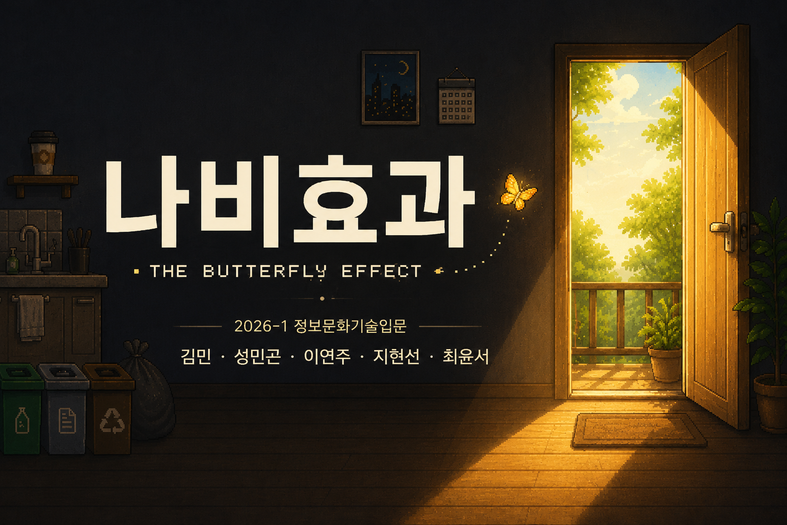

# 🦋 나비효과 (The Butterfly Effect)

## 🎮 게임 실행

https://hyunsunny11.github.io/ButterflyEffect/

## 📖 게임 소개

'나비효과(The Butterfly Effect)'는 환경 문제를 주제로 제작한 인터랙티브 웹 게임입니다.

플레이어는 집 안에 있는 다양한 물건과 전자기기를 올바른 순서로 정리하며 환경 보호의 중요성을 배우게 됩니다. 행동의 순서와 선택에 따라 서로 다른 엔딩이 등장하며, 작은 행동이 큰 변화를 만든다는 메시지를 전달합니다.

## 🕹️ 게임 방법

1. 방 안의 오브젝트를 클릭하여 상호작용합니다.
2. 올바른 순서대로 미니게임을 클리어합니다.
3. 중간에 현관문을 통해 나가면 현재 진행 단계에 따른 엔딩을 확인할 수 있습니다.
4. 모든 미니게임을 완료하면 최종 엔딩을 볼 수 있습니다.

## ✨ 주요 기능

* p5.js 기반 인터랙티브 게임
* 다양한 환경 관련 미니게임
* 멀티 엔딩 시스템
* 픽셀 아트 스타일 그래픽
* 효과음 및 컷신 연출

## 🛠️ 사용 기술

* JavaScript
* p5.js
* HTML5
* CSS3
* GitHub Pages

## 👥 제작

2026-1 정보문화기술입문 프로젝트

* 김민
* 성민곤
* 이연주
* 지현선
* 최윤서

## 📷 게임 화면

게임 플레이 및 다양한 엔딩을 통해 환경 보호의 중요성을 체험할 수 있습니다.
